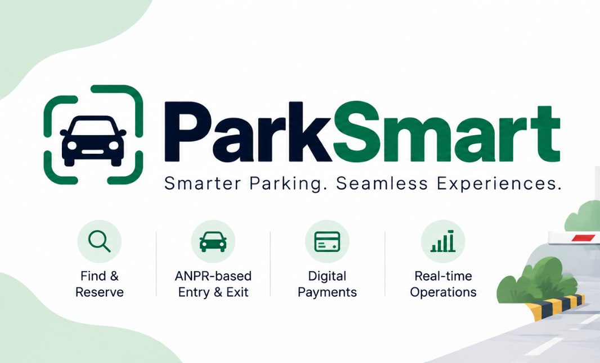
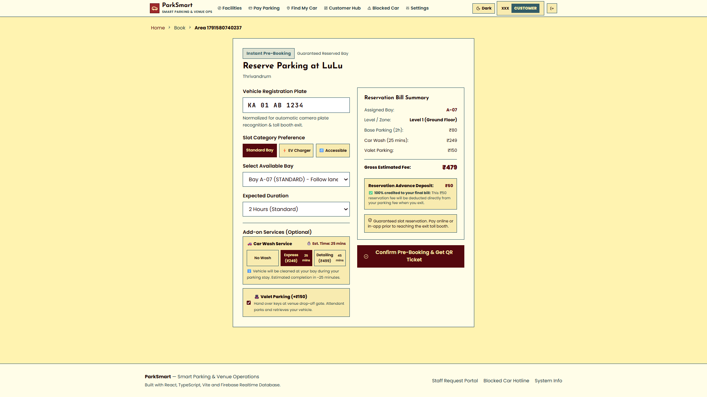
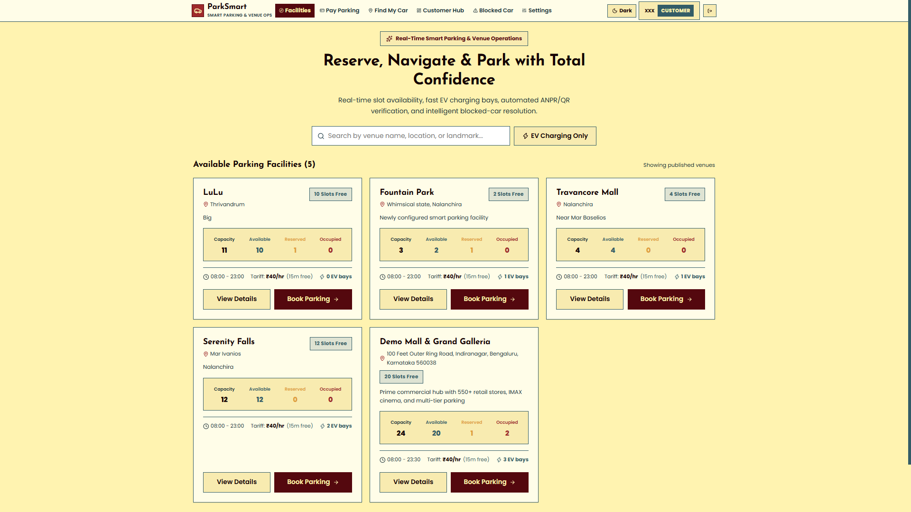
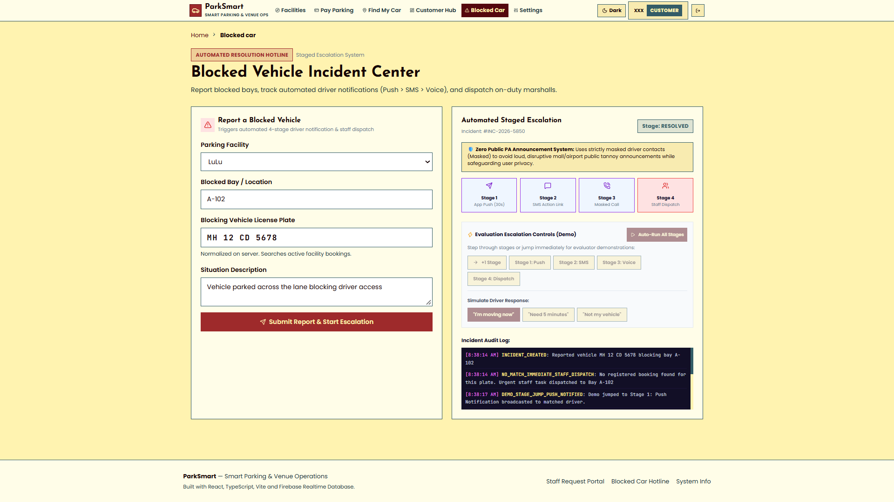
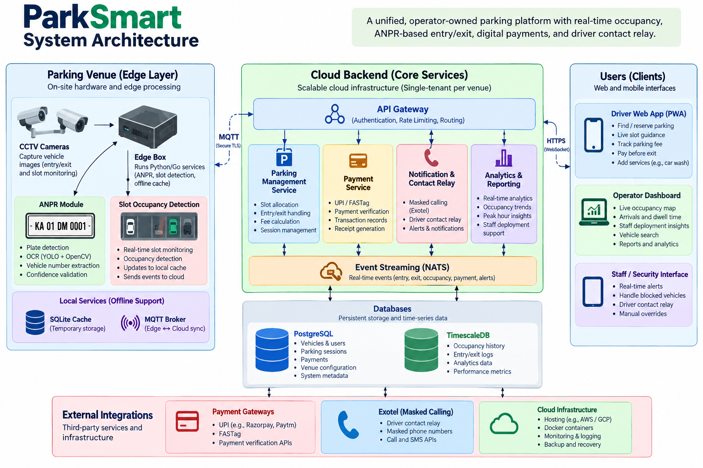

# DEFINE 4.0

The official project submission repository for **DEFINE 4.0 — The World's Realest Hackathon**.

---

# ParkSmart

<!-- Add your project cover image below -->



## Team Information

- **fsociety**:
- **Software**:

## Team Members

| Name | Role | GitHub | LinkedIn |
|------|------|--------|----------|
| Ghanasyam S | Backend | https://github.com/ghanasyam6138-dev | www.linkedin.com/in/ghanasyams |
| Maria Teresa Thomas | Frontend | https://github.com/mariateresathomas | www.linkedin.com/in/mariateresathomas |
| Joshua S Robin | Database | https://github.com/Joshua-S-Robin | https://www.linkedin.com/in/joshua-s-robin/ |
| Adith K | Backend | https://github.com/adithk7 | https://www.linkedin.com/in/adith-k-1a2092368/ |
| Nandita M Menon | Frontend | https://github.com/nandita-mm | https://www.linkedin.com/in/nandita-m-menon?utm_source=share_via&utm_content=profile&utm_medium=member_android |

---

# Project Details

## Overview

The ParkSmart project is a unified software platform that integrates with existing venue hardware to manage both transient and recurring parking sites through a single operator-owned system. It addresses the frustrations of circling for spaces, exit gate queues, and blocked vehicles by providing live space allocation, automated payment processing, and a privacy-preserving driver contact relay. Using a combined edge-box and cloud architecture, the platform delivers a seamless, web app experience for drivers while ensuring venues retain full control of their data and operations.

## Problem Statement

Malls and busy venues lose time and goodwill in their parking areas. Drivers circle looking for space, staff are deployed by guesswork, cars get blocked in, and exits queue at the toll gate. Build a parking platform with two sides. Drivers should be able to find parking or reserve a preferred zone in advance, be guided to an assigned slot on arrival, add services such as a car wash during the visit, track the running parking fee and pay before reaching the exit. The venue operator (for example, a large mall) needs a live operations view of occupancy, arrivals and how long cars stay, with insights for deploying staff, routing incoming traffic and planning for peak days. Also tackle everyday problems such as a car blocking another, where management today resorts to public announcements: give them a way to reach the driver directly without exposing anyone's phone number.

Explain:

- What is the problem?
The core problem is an inefficient parking experience marked by drivers circling for spaces, exit gate bottlenecks, unauthorized vehicles squatting in owned spots, and cars blocking one another. Additionally, venue management lacks real-time data to efficiently deploy staff or smoothly resolve these everyday parking conflicts.
- Who is affected by it?
This problem affects a wide range of drivers, including transient visitors at malls or airports, as well as recurring drivers like residents and daily employees. It also heavily impacts venue operators, security guards, and facility managers who are forced to manually manage gate queues, vehicle disputes, and visitor access.
- Why is solving it important?
Solving this is vital because it vastly improves the driver experience through automated entry, live slot guidance, and seamless exit payments without mandating an app download. Furthermore, a unified solution allows venue operators to retain complete ownership of sensitive data while ensuring that barriers remain safely operational even during network or power outages.
- What are the limitations of existing solutions?
Current parking systems force venues to surrender control of sensitive data to multiple third-party vendors. They also suffer from operational issues like double billing, fail during internet outages, and often require venues to install expensive new hardware. Ultimately, this creates a frustrating experience for drivers, who must juggle multiple apps, proprietary tags, or physical stickers just to manage their parking or resolve blocked-car issues.

## Solution

Explain your proposed solution and how it addresses the identified problem.
Describe the core idea, workflow, and key technologies used to build the solution.

Key TechnologiesEdge Processing & Vision: Local edge boxes run Python or Go services, utilizing MQTT brokers and SQLite caches for offline reliability. They employ YOLOv8/11 and OpenCV to process security camera feeds for real-time slot occupancy and plate recognition.Cloud Infrastructure: The single-tenant cloud core uses Postgres and TimescaleDB for persistent data storage, NATS for event streaming, and a dedicated constraint-scoring API for space allocation.Front-End Applications: The driver and staff interfaces are built as React/Next.js Progressive Web Apps (PWAs) connected via WebSockets to display live occupancy maps and alerts without requiring an app store download.Integrations & Privacy: The architecture leverages Exotel APIs for masked calling, external gateways for UPI/FASTag transactions, and an operator-managed Key Management Service (KMS) with HMAC-SHA256 encryption to securely tokenize personal license plate data.

---

# Demo

### Demo Video

[Watch Project Demo](https://www.youtube.com/watch?v=VIDEO_ID)

> Replace `VIDEO_ID` with your YouTube video ID.

### Screenshots

<!-- Add screenshots of your project here -->







---

# Live Project

https://parksmart-demo-234.web.app/

---

# Technical Implementation

## Technologies Used

| Category | Technologies |
|----------|--------------|
| **Frontend** | React 19, TypeScript 5.9, Vite 8.3, React Router v7 |
| **Styling & UI** | Vanilla CSS Design System with light theme, custom tokens, and Lucide React icons |
| **Database & Realtime** | Firebase Realtime Database (`parksmart-demo-234`), LocalStorage Cache Fallback |
| **Backend & Cloud** | Firebase Cloud Functions (TypeScript), Firebase Admin SDK |
| **Camera & QR** | Browser `navigator.mediaDevices` WebRTC, `qrcode`, `html5-qrcode` |
| **Testing** | Vitest with 17 verified business rule invariant tests |

## System Architecture

## System Architecture

ParkSmart uses an edge–cloud architecture to provide automated number plate recognition (ANPR), real-time parking management, payment processing, and operational analytics. The system connects on-site cameras and edge services with cloud backend components, databases, driver applications, and operator dashboards.



*Figure: ParkSmart system architecture showing the parking venue edge layer, cloud services, databases, user interfaces, and external integrations.*

## Key Features

* **Find My Car:** Easily locate your vehicle using zone or slot-level tracking.


* **Advance Reservations:** Pre-book a parking slot or zone before arriving at the venue.


* **Service Add-ons:** Add EV charging, car wash, or valet parking directly to the reservation.


* **Live Estimates:** View estimated completion times for services like car washes.


* **Seamless Billing:** Any upfront reservation deposit is automatically applied to the final parking fee.


* **Accessible Parking:** Dedicated selection options for drivers requiring accessible parking spots.


* **Ticket Validations:** Dynamic fee validations based on linked store purchases at malls or duty-free spending/flight details at airports.


* **Blocked-Car Alert System:** A privacy-first contact relay allows users or staff to notify the driver of a blocking car via masked calls or push alerts, eliminating the need for public PA announcements.


* **Pre-Exit Digital Payments:** Skip the toll gate queue by paying the parking fee directly in the web app before walking to the vehicle.


* **Data Protection:** Built-in privacy controls and tokenized license plates ensure user data remains secure and strictly owned by the venue operator.


* **Live Operator Console:** Provides venue staff with real-time heat maps of occupancy, hourly arrivals, and vehicle dwell times.


* **Sensorless Site Support:** Operates fully even at venues with zero existing hardware sensors by utilizing pillar QR check-ins and smart occupancy engines.

---

# Setup Instructions

## 🚀 Quick Start & Local Development

### Prerequisites
- **Node.js**: v20.x or higher
- **npm**: v10.x or higher
### 1. Clone the Repository

```bash
git clone https://github.com/ghanasyam6138-dev/DEFINE4.0

### 2. Installation
Clone or navigate to the project directory:
```bash
cd "d:/Parking sys"
npm install
```

### 3. Run the Development Server
```bash
npm run dev
```
Open your browser at `http://localhost:5173`. The application automatically initializes the pre-seeded **Demo Mall Indiranagar** facility and demo credentials.

### 4. Run Test Suite
To verify all 17 core business logic invariant tests:
```bash
npm test
```

### 5. Build for Production
To type-check and generate optimized production assets in `dist/`:
```bash
npm run build
```

---


